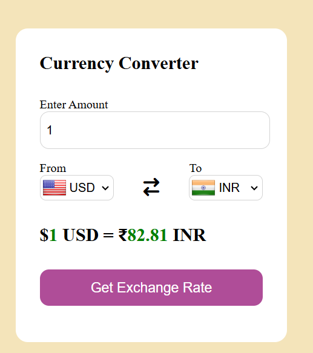

# 💱 Currency Converter Web App

A responsive and stylish **Currency Converter** built using **HTML, CSS, JavaScript**, and powered by a **real-time currency exchange API**. Easily convert between world currencies with updated rates and country flags.



---

## 🌍 Features

✅ Convert between 160+ currencies  
✅ Real-time exchange rates using public API  
✅ Dynamic country flags via [FlagsAPI](https://flagsapi.com)  
✅ Smart default: USD → INR  
✅ Swappable currency dropdowns  
✅ Input validation  
✅ Responsive design  
✅ Smooth user experience

---

## ⚙️ Tech Stack

- **HTML5** – structure  
- **CSS3** – styling & layout  
- **JavaScript (ES6)** – logic & API integration  
- **Currency API** – real-time exchange rates  
- **FlagsAPI** – flag icons by country code  
- **countryList.js** – custom JS file containing country codes and currency mapping

---

## 🚀 How It Works

1. Select the currencies you want to convert between.
2. Enter the amount.
3. Click **Get Exchange Rate**.
4. Instantly see the exchange result and both country flags.
5. Click the **↔️ swap icon** to reverse the currencies (flags and rate update automatically).

-------------
## 📂 File Structure
.
├── converter.html
├── converter.css
├── converter.js
├── countries.js
├── converter.png


---

## 🛠️ Setup Instructions

```bash
1. Clone the repository:
   git clone https://github.com/Prateeksri1308/Currency-Converter-Web-App

2. Navigate into the folder:
   cd Currency-Converter-Web-App

3. Open index.html in your browser:
   start converter.html

-------------

🔗 APIs Used
🌐 Currency API
Fetch live exchange rates
https://2024-03-06.currency-api.pages.dev/v1/currencies/
---------
🏳️ Flags API
Display country flags dynamically
https://flagsapi.com/COUNTRY_CODE/shiny/64.png

---
🔮 Future Enhancements
🌙 Dark Mode Support

🪙 Crypto Currency Support (BTC, ETH)

📈 Historical Rate Graph (Mini Chart)

💾 Offline fallback using Local Storage

🌐 Multi-language support

-------
🙌 Acknowledgements
🔁 API by Currency-API.pages.dev

🏳️ Flags from FlagsAPI.com

🧠 Icons from Font Awesome

💡 Project inspiration from modern UI/UX designs
----
🧑‍💻 Author
Prateek Srivastava
🎓 BCA Student @ UPES
💻 Passionate Backend Developer
📈 Learning Web Technologies, APIs, and UI Enhancements

🔗 GitHub: github.com/Prateeksri1308

🔗 LinkedIn: https://www.linkedin.com/in/prateek-srivastava-backend

🌍 Portfolio: Coming soon...
